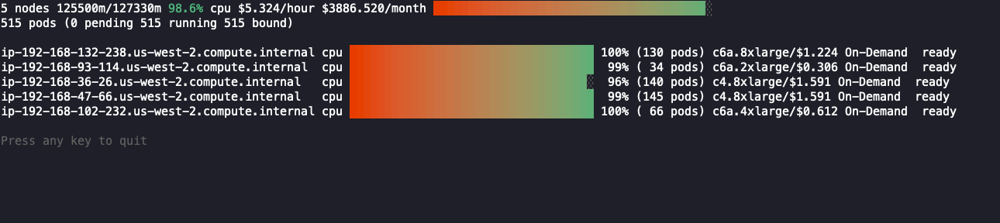

[](https://github.com/awslabs/eks-node-viewer/blob/main/LICENSE)
[](https://github.com/awslabs/eks-node-viewer/issues)
[](https://github.com/awslabs/eks-node-viewer/actions/workflows/test.yaml)

## Usage

`eks-node-viewer` is a tool for visualizing dynamic node usage within a cluster.  It was originally developed as an internal tool at AWS for demonstrating consolidation with [Karpenter](https://karpenter.sh/).  It displays the scheduled pod resource requests vs the allocatable capacity on the node.  It *does not* look at the actual pod resource usage.



### Talks Using eks-node-viewer

- [Containers from the Couch: Workload Consolidation with Karpenter](https://www.youtube.com/watch?v=BnksdJ3oOEs)
- [AWS re:Invent 2022 - Kubernetes virtually anywhere, for everyone](https://www.youtube.com/watch?v=OB7IZolZk78)

### Installation

Please either fetch the latest [release](https://github.com/awslabs/eks-node-viewer/releases) or install manually using:
```shell
go install github.com/awslabs/eks-node-viewer/cmd/eks-node-viewer@latest
```

Note: This will install it to your `GOBIN` directory, typically `~/go/bin` if it is unconfigured.

## Usage
```shell
Usage of ./eks-node-viewer:
  -attribution
    	Show the Open Source Attribution
  -context string
    	Name of the kubernetes context to use
  -disable-pricing
    	Disable pricing lookups
  -extra-labels string
    	A comma separated set of extra node labels to display
  -kubeconfig string
    	Absolute path to the kubeconfig file (default "~/.kube/config")
  -node-selector string
    	Node label selector used to filter nodes, if empty all nodes are selected
  -resources string
    	List of comma separated resources to monitor (default "cpu")
  -v	Display eks-node-viewer version
  -version
    	Display eks-node-viewer version
```

### Examples
```shell
# Standard usage
eks-node-viewer
# Karenter nodes only
eks-node-viewer --node-selector "karpenter.sh/provisioner-name"
# Display both CPU and Memory Usage
eks-node-viewer --resources cpu,memory
# Display extra labels, i.e. AZ
eks-node-viewer --extra-labels topology.kubernetes.io/zone
# Specify a particular AWS profile and region
AWS_PROFILE=myprofile AWS_REGION=us-west-2
```

### Default Options
You can supply default options to `eks-node-viewer` by creating a file named `.eks-node-viewer` in your home directory and specifying
options there. The format is `option-name=value` where the option names are the command line flags:
```text
# select only Karpenter managed nodes
node-selector=karpenter.sh/provisioner-name

# display both CPU and memory
resources=cpu,memory
```

### Troubleshooting

#### NoCredentialProviders: no valid providers in chain. Deprecated.

This CLI relies on AWS credentials to access pricing data if you don't use the `--disable-pricing` option. You must have credentials configured via `~/aws/credentials`, `~/.aws/config`, environment variables, or some other credential provider chain.

See [credential provider documentation](https://docs.aws.amazon.com/sdk-for-go/api/aws/session/) for more.

#### I get an error of `creating client, exec plugin: invalid apiVersion "client.authentication.k8s.io/v1alpha1"`

Updating your AWS cli to the latest version and [updating your kubeconfig](https://docs.aws.amazon.com/cli/latest/reference/eks/update-kubeconfig.html) should resolve this issue.

## Development

### Building

```shell
$ make build
```

Or local execution of GoReleaser build:
```shell
$ make goreleaser
```
