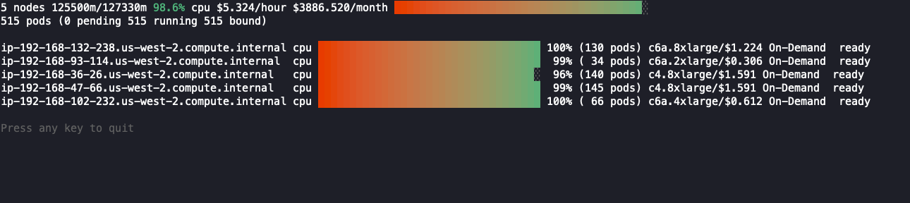

[](https://github.com/awslabs/eks-node-viewer/blob/main/LICENSE)
[](https://github.com/awslabs/eks-node-viewer/issues)
[](https://github.com/awslabs/eks-node-viewer/actions/workflows/test.yaml)

## Usage

`eks-node-viewer` is a tool for visualizing dynamic node usage within a cluster.  It was originally developed as an internal tool at AWS for demonstrating consolidation with [Karpenter](https://karpenter.sh/).  It displays the scheduled pod resource requests vs the allocatable capacity on the node.  It *does not* look at the actual pod resource usage.



### Talks Using eks-node-viewer

- [Containers from the Couch: Workload Consolidation with Karpenter](https://www.youtube.com/watch?v=BnksdJ3oOEs)
- [AWS re:Invent 2022 - Kubernetes virtually anywhere, for everyone](https://www.youtube.com/watch?v=OB7IZolZk78)

### Installation

#### Homebrew

```bash
brew tap aws/tap
brew install eks-node-viewer
```

#### Manual
Please either fetch the latest [release](https://github.com/awslabs/eks-node-viewer/releases) or install manually using:
```shell
go install github.com/awslabs/eks-node-viewer/cmd/eks-node-viewer@latest
```

Note: This will install it to your `GOBIN` directory, typically `~/go/bin` if it is unconfigured.

## Usage
```shell
Usage of ./eks-node-viewer:
  -attribution
    	Show the Open Source Attribution
  -context string
    	Name of the kubernetes context to use
  -disable-pricing
    	Disable pricing lookups
  -extra-labels string
    	A comma separated set of extra node labels to display
  -group-by string
    	Node label to summarize usage and cost by, optionally restricted to a comma separated list of its values, e.g. 'karpenter.sh/nodepool' or 'karpenter.sh/nodepool=default,gpu'. If empty no summary is displayed
  -groups-only
    	Hide the individual node list and only display the --group-by summary. Toggled at runtime with 'g'
  -kubeconfig string
    	Absolute path to the kubeconfig file (default "~/.kube/config")
  -node-selector string
    	Node label selector used to filter nodes, if empty all nodes are selected
  -node-sort string
    	Sort order for the nodes, either 'creation' or a label name. The sort order can be controlled by appending =asc or =dsc to the value. (default "creation")
  -resources string
    	List of comma separated resources to monitor (default "cpu")
  -style string
    	Three color to use for styling 'good','ok' and 'bad' values. These are also used in the gradients displayed from bad -> good. (default "#04B575,#FFFF00,#FF0000")
  -v	Display eks-node-viewer version
  -version
    	Display eks-node-viewer version
```

### Keys

| Key   | Action                                                        |
|-------|---------------------------------------------------------------|
| `←/→` | Page through whichever list is on screen                      |
| `g`   | Toggle the `--group-by` summary                               |
| `n`   | Toggle the node list                                          |
| `q`   | Quit                                                          |

`g` and `n` never leave both sections hidden. With a lot of groups the summary can fill the
screen, so hiding one of the two is the way to read the other.
o
### Examples
```shell
# Standard usage
eks-node-viewer
# Karpenter nodes only
eks-node-viewer --node-selector karpenter.sh/nodepool
# Display both CPU and Memory Usage
eks-node-viewer --resources cpu,memory
# Display extra labels, i.e. AZ
eks-node-viewer --extra-labels topology.kubernetes.io/zone
# Sort by CPU usage in descending order
eks-node-viewer --node-sort=eks-node-viewer/node-cpu-usage=dsc
# Cost and usage per nodepool, without the per-node detail
eks-node-viewer --group-by karpenter.sh/nodepool --groups-only
# Cost and usage per team, using your own node label
eks-node-viewer --group-by company.com/team
# A few nodepools at once, instead of one terminal per nodepool
eks-node-viewer --group-by karpenter.sh/nodepool=default,gpu,spot
# Specify a particular AWS profile and region
AWS_PROFILE=myprofile AWS_REGION=us-west-2
```

### Grouping By Label

`--group-by` adds a summary block that aggregates every node sharing a value for the given label.
Each group shows its node count, pod count, resource requests vs allocatable, the percentage in use
and the cost, which answers questions like "how much is this nodepool costing me" or "how much are
the nodes belonging to this team costing me":

```shell
eks-node-viewer --group-by karpenter.sh/nodepool
```

```text
6 nodes  (   98304Mi/377176Mi)  26.1% memory  ██████████░░░░░░░░░░░░  $4.608/hour | $3,363.840/month
48 pods (0 pending 48 running 48 bound)

default  4 nodes  32 pods  (65536Mi/251451Mi)  26.1% memory  ██████████░░░░░░░░░░░░  $3.072/hour | $2,242.560/month
gpu      2 nodes  16 pods  (32768Mi/125725Mi)  26.1% memory  ██████████░░░░░░░░░░░░  $1.536/hour | $1,121.280/month
```

Appending a comma separated list of values restricts the view to them, so a single flag both picks
the nodepools to watch and breaks the cost down by them, replacing a terminal per nodepool:

```shell
eks-node-viewer --group-by karpenter.sh/nodepool=default,gpu
```

A few notes:

- The label is any node label, written out in full. Grouping by team, zone, instance type or
  capacity type is the same flag with a different key.
- Values are optional. A bare `--group-by` label only says how to aggregate and leaves the node
  selection alone, which keeps the nodes that don't carry the label visible. `--node-selector` is
  still the flag to use to filter on a label other than the one being grouped by.
- The percentage is the usage of the group as a whole, so it is weighted by node size rather than
  being the plain average of each node's percentage. It also covers every resource passed to
  `--resources`.
- Nodes without the label are collected into a `<none>` group, which always sorts last.
- A cost prefixed with `>=` means at least one node in the group has an unknown price, so the real
  cost is higher than the number shown. A group with no known price at all shows no cost.
- Add `--groups-only` to start with the per-node list hidden. Either section can be toggled at
  runtime without restarting: `g` for the summary and `n` for the node list. On a cluster with
  many groups the summary fills the screen, so hiding it with `g` is how you get back to
  reading node by node.

### Computed Labels

`eks-node-viewer` supports some custom label names that can be passed to the `--extra-labels` to display additional node information. 

- `eks-node-viewer/node-age` - Age of the node
- `eks-node-viewer/node-cpu-usage` - CPU usage (requests)
- `eks-node-viewer/node-memory-usage` - Memory usage (requests)
- `eks-node-viewer/node-pods-usage` - Pod usage (requests)
- `eks-node-viewer/node-ephemeral-storage-usage` - Ephemeral Storage usage (requests)

### Default Options
You can supply default options to `eks-node-viewer` by creating a file named `.eks-node-viewer` in your home directory and specifying
options there. The format is `option-name=value` where the option names are the command line flags:
```text
# select only Karpenter managed nodes
node-selector=karpenter.sh/nodepool

# display both CPU and memory
resources=cpu,memory

# show the zone and nodepool name by default
extra-labels=topology.kubernetes.io/zone,karpenter.sh/nodepool

# summarize cost and usage per nodepool, optionally only for some of them
group-by=karpenter.sh/nodepool

# and start with the node list hidden
groups-only=true

# sort so that the newest nodes are first
node-sort=creation=asc

# change default color style
style=#2E91D2,#ffff00,#D55E00
```

### IAM Permissions

`eks-node-viewer` reads node and pod data through the Kubernetes API (using your kubeconfig), so it needs no EKS or STS API permissions for that. It only calls AWS for pricing data, which requires:

```json
{
  "Version": "2012-10-17",
  "Statement": [
    {
      "Effect": "Allow",
      "Action": [
        "pricing:GetProducts",
        "ec2:DescribeSpotPriceHistory"
      ],
      "Resource": "*"
    }
  ]
}
```

`pricing:GetProducts` is used for on-demand and Fargate pricing, and `ec2:DescribeSpotPriceHistory` for spot pricing. Neither action supports resource-level scoping, so `Resource` is `*`.

If you run with `--disable-pricing`, no AWS permissions are needed at all.

### Troubleshooting

#### NoCredentialProviders: no valid providers in chain. Deprecated.

This CLI relies on AWS credentials to access pricing data if you don't use the `--disable-pricing` option. You must have credentials configured via `~/aws/credentials`, `~/.aws/config`, environment variables, or some other credential provider chain.

See [credential provider documentation](https://docs.aws.amazon.com/sdk-for-go/api/aws/session/) for more.

#### I get an error of `creating client, exec plugin: invalid apiVersion "client.authentication.k8s.io/v1alpha1"`

Updating your AWS cli to the latest version and [updating your kubeconfig](https://docs.aws.amazon.com/cli/latest/reference/eks/update-kubeconfig.html) should resolve this issue.

## Development

### Building

```shell
$ make build
```

Or local execution of GoReleaser build:
```shell
$ make goreleaser
```
